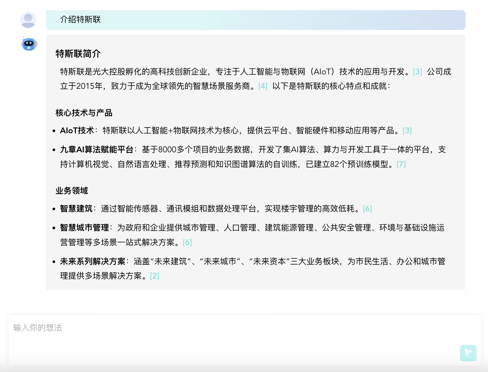

## tslapp-fullstack-assignment

### 关于我们
[特斯联](https://www.tslsmart.com/)是光大控股孵化的高科技创新企业，专注于人工智能与物联网（AIoT）技术的应用与开发。公司成立于2015年，致力于成为全球领先的智慧场景服务商。
我们是特斯联智能系统研发中心/软件项目部，负责特斯联创新业务(AI/大模型)相关产品的研发。

### 关于技术栈
在这里，每位开发人员都可以独立负责包括前端、后端、测试、部署、维护中的所有开发工作，以下是我们团队采用的技术栈：
- [Typescript](https://www.typescriptlang.org/)
- [NodeJS](https://nodejs.org)
- [Express](https://expressjs.com/)
- [TypeORM](https://typeorm.io/)
- [Routing-Controller](https://github.com/typestack/routing-controllers)
- [Postgres](https://www.postgresql.org/)
- [Docker](https://www.docker.com/)
- [Vue3](https://vuejs.org/)
- [TailwindCSS](https://tailwindcss.com/)

### 关于此测试
这是一个聊天机器人的系统截图，希望你能实现前端和后端项目中的相关代码完成此功能：

以下是具体要求:
1. 运行开发环境：`docker compose up -d`
2. 后端
   - 运行后端项目`cd backend && npm run dev`
   - 实现[chatcontroller.ts](backend/src/controller/chatcontroller.ts)中的`completion`函数，流式返回聊天结果
3. 前端
   - 运行前端项目`cd frontend && npm run dev`
   - 按上面的系统截图创建前端页面（可用AI工具生成）
   - 调用后端服务，并显示聊天结果（支持Markdown格式）
4. 请无需在UI样式中投入太多精力
5. 可以Fork此项目并创建Pull Request来提交代码，或者将代码发送给HR
